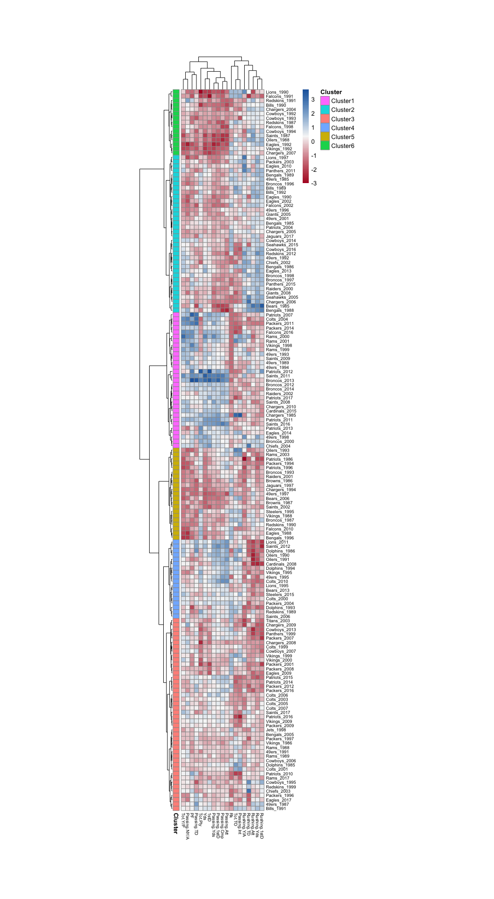

Top Defenses
================
Alex Chitsazan
11 August, 2018

-   [Top Defenses](#top-defenses)
    -   [Defenses MDS](#defenses-mds)
    -   [Defenses Heatmap](#defenses-heatmap)
    -   ['Elite' Cluster Defense](#elite-cluster-defense)
-   [Top Offenses](#top-offenses)
    -   [Offenses MDS](#offenses-mds)
    -   [Offenses Heatmap](#offenses-heatmap)
    -   ['Elite' Cluster Offenses](#elite-cluster-offenses)

Top Defenses
------------

### Defenses MDS

Recently took a workshop at the University of Washington on unsupervised machine learning so I decided to apply it to sports. What I did is I used a webscraper that downloaded and scraped the team defense data for the top 5 defenses for every team from 1985 to Presenst. I then scaled and normalized the data and applied a deminsion reduction (multidemensional scaling) algorythm to try and represent the data in a 2D plot. What this multidimensional analysis does is take all of the traits (in this case defensive traits such as yards against, 1st down %, etc) and calculates a value of all combined traits in 2 dimensions to plot relative distances, essentially a similarity score between every team in the dataset. However the axis scale is arbitrary only, relative distance between teams.

Then I applied a heerierachical clustering algorithm to group defenses into clusters of teirs. In the plot these will be the different colors The colors take these distances and build a tree that puts the most similar teams into groups of related they are. So teams like the 1985 Bears, 1991 Eagles and the 2000 ravens are put in the same group cause they are really really good. It does this for every team and places them in clusters. You can think of these as tiers. This is what the colors are and is called hierarchal clustering.

Some things that I find very interesting:

1.  Wow Ravens 2000 was an all time great. Huge outlier.
2.  Cluster 1 clearly all time great. 85 bears, 2013 seahawks, 2000 Ravens, 2008 Steelers, 1991 Eagles, etc.
3.  Browns\_2011 and patriots\_1988 it looks like may have been outliers (not as good) when compared to top defenses.
4.  Jags and Vikings from 2017 both made top cluster

### Defenses Heatmap

Here is a heatmap that plots scaled normalized data and gives a little insight into why the specfic defenses were chosen. It's pretty interesting how tightly knight the best defenses group is (2000 ravens, 2008 Stelers) is very distinguishable by them being great in all categories AS WELL as being the best interceptions

### 'Elite' Cluster Defense

It is apparent that cluster 1 seems to encompass the tier with the most 'elite' denfenses. Since that cluster contained 48 teams, I decided to extract that group and then recluster to see how the elite cluster segregates. Cluter 1 of this the new data contains what most football exterts would consider the best defenses of all time.

Zooming in on the heatmap, you can start to see why the elite cluster truly is elite. As mentioned before, it seems to be very good Passing/Rushing numbers AS WELL as the ability to capitlize and get turnovers.

Top Offenses
------------

Then doing a similar thing for offenses. I downloaded the same data (top 5 offenses) for every year from 1985 to 2017 and ran the same dimension reduction and herirachical clustering programs.

Some things that I find very interesting:

1.  Denver 2013 (Peyton Manning 55 TD year) truly was something special and an outlier.
2.  Cluster 1 contains the 'elite' offenses of all time (Broncos, 2013, Rams 2000, Falcons 2016, Patriots 2007, etc)
3.  Pretty remarkable to see how great all time some of these saints offenses have been

### Offenses MDS

Heatmap showcasing the z-score normalized values of each cluster to show relative levels of why each cluster was assigned. What I find most fascinating is the cluster the average sports fan considers to be the 'elite' offenses, the data is heavily weighted to be great all time passing offeneses. Unlike defenses where the best of all time had all-around high end stats encompassing ALL categories, the elite offenses have great passing stats. Even more shocking, they actually have low-end rushing stats. It is easy to see why QB is by far the most important position in football.

### Offenses Heatmap

### 'Elite' Cluster Offenses

Like for defenses, it is apparent that cluster 1 seems to encompass the tier with the most 'elite' offenses. Since that cluster contained 31 teams, I decided to extract that group and then recluster to see how the 'elite' cluster segregates. Zooming in on the heatmap, you can start to see why the elite cluster truly is elite. You can first see as I said before passing is very important. Also, limiting TOs.

